# Cloudflare Tunnel + Kubernetes Setup

A secure, zero-maintenance SSL solution for exposing Kubernetes services using Cloudflare Tunnels with ingress-nginx.

## 🏗️ Architecture Overview

This setup combines **Cloudflare Tunnels** for secure external access with **ingress-nginx** for flexible internal routing. Your home IP stays completely hidden while providing enterprise-grade security and automatic SSL certificates.

### Key Benefits

- ✅ **Zero open inbound ports** - completely secure
- ✅ **Automatic SSL certificates** - no cert-manager needed
- ✅ **Hidden IP address** - DDoS protection included
- ✅ **Dynamic service routing** - standard Kubernetes ingress resources
- ✅ **Wildcard domain support** - `*.batk.me` automatically routed

## 🔧 Components

### External Layer
- **Cloudflare**: DNS, SSL termination, DDoS protection
- **Cloudflare Tunnel**: Encrypted outbound connection from cluster

### Kubernetes Cluster
- **ingress-nginx**: HTTP routing and load balancing (ClusterIP only)
- **Headscale**: Self-hosted Tailscale control server
- **Future services**: Any service you add via standard ingress resources

## 🚀 Quick Start

### 1. Prerequisites
- Domain managed by Cloudflare (`batk.me`)
- Kubernetes cluster with Helm
- `cloudflared` CLI tool

### 2. Create Cloudflare Tunnel
```bash
# Option 1: Via Cloudflare Dashboard (Recommended)
# 1. Go to Cloudflare Zero Trust Dashboard
# 2. Navigate to Access > Tunnels
# 3. Create new tunnel named "k8s-tunnel"
# 4. Copy the tunnel token (starts with "ey...")

# Option 2: Via CLI
cloudflared tunnel login
cloudflared tunnel create k8s-tunnel
# Get tunnel token: cloudflared tunnel token k8s-tunnel
```

### 3. Configure Tunnel Secret
```bash
# Create secret with tunnel token
kubectl create secret generic cloudflared-secret \
  --from-literal=TUNNEL_TOKEN="" \
  -n cloudflared
```

### 3. Deploy ingress-nginx
```bash
# Update ingress-nginx to use ClusterIP
helm repo add ingress-nginx https://kubernetes.github.io/ingress-nginx
helm install ingress-nginx ingress-nginx/ingress-nginx -f values.yaml
```

### 4. Deploy Cloudflare Tunnel
```bash
# Update the TUNNEL_TOKEN in the secret section
# Then apply the configuration
kubectl apply -f cloudflare-tunnel.yaml

# Verify tunnel is running
kubectl get pods -n cloudflare-tunnel
kubectl logs -n cloudflare-tunnel deployment/cloudflared
```

### 5. Deploy Services
```bash
# Deploy Headscale (or any service)
kubectl apply -f headscale.yaml

# Create standard ingress resources (no TLS section needed)
kubectl apply -f ingress-resources.yaml
```

## 📝 Adding New Services

Adding new services is as simple as creating standard Kubernetes ingress resources:

```yaml
apiVersion: networking.k8s.io/v1
kind: Ingress
metadata:
  name: my-new-service
  annotations:
    kubernetes.io/ingress.class: "nginx"
spec:
  rules:
  - host: mynewservice.batk.me
    http:
      paths:
      - path: /
        pathType: Prefix
        backend:
          service:
            name: my-service
            port:
              number: 80
```

**No SSL configuration needed** - Cloudflare handles all certificates automatically!

## 🛡️ Security Features

### Network Security
- **No inbound firewall rules required**
- **Outbound-only tunnel connection**
- **Zero attack surface** on your public IP

### Cloudflare Protection
- **Enterprise DDoS protection**
- **Bot detection and mitigation**
- **Rate limiting and geographic filtering**
- **Web Application Firewall (WAF)**

### Real Client IPs
The setup preserves real client IP addresses through Cloudflare headers for accurate logging and rate limiting.

## 🔍 Monitoring

### Tunnel Health
```bash
# Check tunnel status
kubectl logs -n cloudflare-tunnel deployment/cloudflared

# View tunnel metrics
kubectl port-forward -n cloudflare-tunnel deployment/cloudflared 2000:2000
curl http://localhost:2000/metrics
```

### Service Health
```bash
# Check ingress-nginx
kubectl get pods -n ingress-nginx

# Check your services
kubectl get ingress --all-namespaces
```

## 🎯 Use Cases

This setup is perfect for:
- **Self-hosted VPN** (Headscale/Tailscale)
- **Home lab services** (code servers, dashboards)
- **Family applications** (photo sharing, file sync)
- **Development environments** (staging deployments)

## 🔄 Maintenance

### Zero-Maintenance Items
- ✅ **SSL certificates** (automatic renewal)
- ✅ **DNS propagation** (handled by Cloudflare)
- ✅ **DDoS protection** (always active)

### Occasional Tasks
- 🔄 **Update cloudflared image** (security updates)
- 🔄 **Monitor tunnel metrics** (optional)
- 🔄 **Review Cloudflare security logs** (optional)

## 🆚 vs Traditional Setup

| Aspect | Traditional (LoadBalancer) | Cloudflare Tunnel |
|--------|---------------------------|-------------------|
| **Open Ports** | 443 exposed | None |
| **SSL Management** | cert-manager + Let's Encrypt | Automatic |
| **DDoS Protection** | Home router only | Enterprise-grade |
| **IP Exposure** | Public IP visible | Hidden |
| **Certificate Challenges** | Complex HTTP/DNS validation | None needed |
| **Firewall Rules** | Manual port forwarding | None |

## 🤝 Contributing

This setup can be extended with:
- **Multiple tunnel replicas** for high availability
- **Cloudflare Access** for additional authentication
- **Custom error pages** through Cloudflare
- **Advanced WAF rules** for specific applications

---

**Questions?** Check the Cloudflare Tunnel [documentation](https://developers.cloudflare.com/cloudflare-one/connections/connect-apps/) or Kubernetes [ingress guide](https://kubernetes.io/docs/concepts/services-networking/ingress/).

```mermaid
graph TB
    subgraph "Internet"
        Client[👤 Client Device]
        Friend[👥 Friends/Family]
    end
    
    subgraph "Cloudflare Edge"
        CF[🌐 Cloudflare]
        SSL[🔒 SSL Termination]
        DDoS[🛡️ DDoS Protection]
        CF --> SSL
        SSL --> DDoS
    end
    
    subgraph "Home Network"
        Router[🏠 Router - No Open Ports!]
        
        subgraph "Kubernetes Cluster"
            subgraph "cloudflare-tunnel namespace"
                Tunnel[☁️ cloudflared - Outbound Connection]
            end
            
            subgraph "ingress-nginx namespace"
                Nginx[⚡ ingress-nginx - ClusterIP Service]
            end
            
            subgraph "headscale namespace"
                Headscale[🔗 Headscale - VPN Control Server]
                HeadscaleDB[(💾 SQLite DB)]
                Headscale --> HeadscaleDB
            end
            
            subgraph "Other Services"
                Code[💻 code.batk.me - Your existing service]
                Other[📱 other.batk.me - Future services]
            end
            
            Tunnel -.->|Routes *.batk.me| Nginx
            Nginx -->|HTTP routing| Headscale
            Nginx -->|HTTP routing| Code
            Nginx -->|HTTP routing| Other
        end
    end
    
    %% Client connections
    Client -->|HTTPS requests| CF
    Friend -->|HTTPS requests| CF
    
    %% Cloudflare to tunnel
    DDoS -.->|Encrypted tunnel vpn.batk.me code.batk.me *.batk.me| Tunnel
    
    %% Styling
    classDef cloudflare fill:#f96,stroke:#333,stroke-width:2px
    classDef kubernetes fill:#326ce5,stroke:#fff,stroke-width:2px,color:#fff
    classDef service fill:#4caf50,stroke:#333,stroke-width:2px
    classDef client fill:#ff9800,stroke:#333,stroke-width:2px
    
    class CF,SSL,DDoS cloudflare
    class Tunnel,Nginx,Headscale,Code,Other kubernetes
    class Client,Friend client
```


